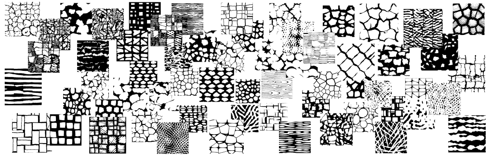
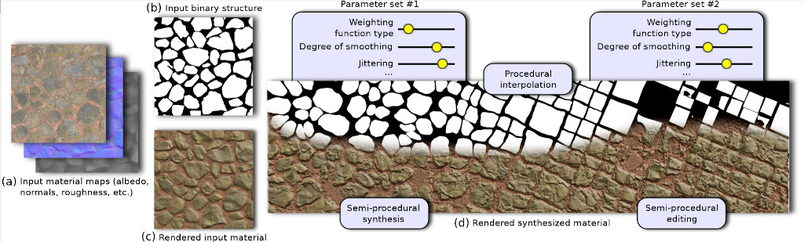
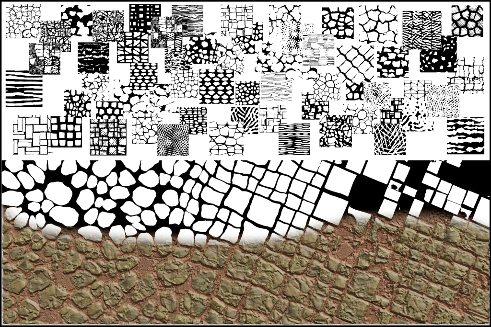
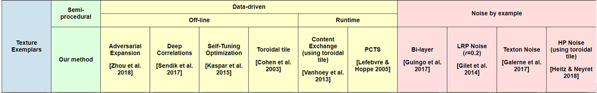
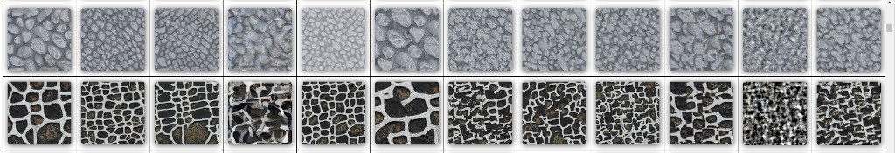
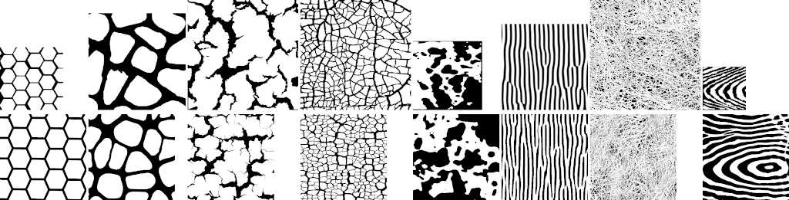
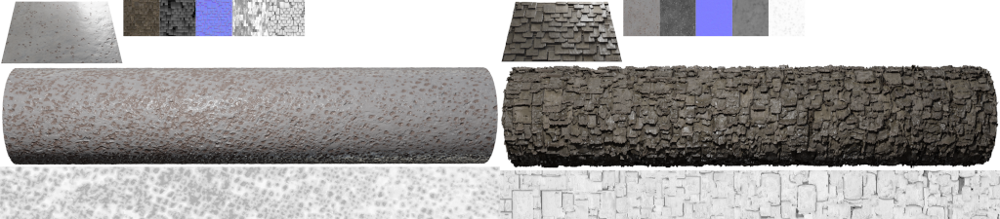
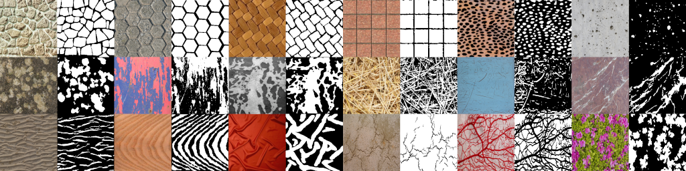
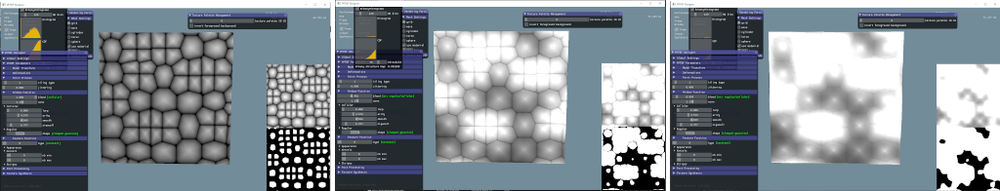
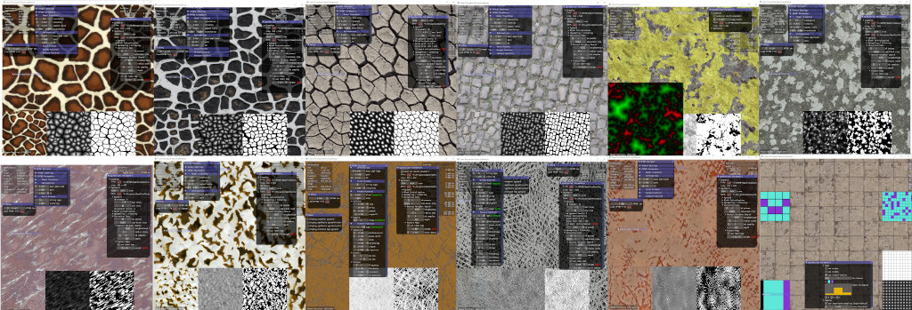

# Semi-Procedural Textures Using Point Process Texture Basis Functions

<!--


-->



This is the page of our EGSR 2020 CGF track paper:

P. [Guehl](https://pascalguehl.jimdofree.com/), R. [Allègre](https://igg.icube.unistra.fr/index.php/R%C3%A9mi_All%C3%A8gre), J.-M. [Dischler](https://dpt-info.di.unistra.fr/~dischler/), B. [Benes](http://hpcg.purdue.edu/bbenes/), E. [Galin](https://perso.liris.cnrs.fr/eric.galin/).
Semi-Procedural Textures Using Point Process Texture Basis Functions.
To appear in Computer Graphics Forum (EGSR 2020 special issue), 39(4),
2020.

#### Table of contents

1. [Paper](#Paper)
2. [Supplemental materials](#Supplemental-materials)
3. [Code and binaries](#Code-and-binaries)
4. [Data](#Data)
5. [Citation](#Citation)

## Paper

Available soon.

<!--
## Note

This work can be seen as a small step in the spirit of the "Inverse Shade Trees" approach, being able to retrieve the appearance from an image as a graph of nodes and edit it interactively.

This work also tries to mix Research, Industry and Art to enhance the creativity and productivity of digital artists from the video game and film industries. Node-based texturing tools from industry (such as Substance Designer) could benefit from this kind of "art-directable" textures and materials to create complex appearances.
-->

## Acknowledgments
This work is supported by the [HDWorlds](http://hdworlds.unistra.fr/index.php/Accueil) project funded by the French National Research Agency (project ID: ANR-16-CE33-0001).

## Supplemental materials

<!--
### [1] Texture Synthesis Comparisons
-->

 - **Supplemental #1** : Available soon. This supplemental material provides semi-procedural texture synthesis results using our method and comparisons to state-of-the-art texture synthesis methods.

<!--
 #### e.g.: Texture synthesis comparisons
 
 Database of 138 textures (cells, cracks, dots, lines, scratches, waves, networks, tilings, etc...) processed by 11 different texture synthesis methods. In these experiments, input textures are synthesized 2 times larger. Note: this is not a limit of our method, but due to some deep learning methods this already required between 1 and 2 months of computation even with GPUs...
 
 
 
 
 -->
 
 <!--
 ### [2] PPTBF Parameters Estimation, Noise Comparisons and Material Synthesis
 -->
 
 - **Supplemental #2** : Available soon. This supplemental material provides additional results on: PPTBF parameters estimation, comparisons to noise by example (structure only), material synthesis results, and synthesis results with structure transitions.
 
 <!--
 #### e.g.: PPTBF Parameter estimation (i.e. by-example procedural structures)
 
 Database of 147 segmented images (cells, cracks, dots, lines, scratches, waves, networks, tilings, etc...), from automatic parameter estimations to refinement and fine-tuning :
 
 
 
 #### e.g.: Material synthesis (with transitions)
 
 Database of 3D scanned materials and procedural PBR materials.
 
 
 -->
 
 <!--
 ### [3] Database of input exemplars
-->
 
 - **Supplemental #3** : Available soon. This supplemental material contains the database of binary structures used for the paper in full quality. Note that for reasons of terms of use, we do not provide all corresponding texture exemplars. The folder Structures contains manually segmented binary structures. The
 folder Structures_with_PPTBF contains manually segmented binary structures with estimated PPTBF
 parameters, that can be used for procedural structure synthesis.
 
 <!--
 #### e.g.: Database of Textures
 
  Database of approximately 150 textures, 10 scanned materials and 10 procedural PBR materials. More to come...
 
 
 -->

## Code and binaries

IMPORTANT: Please, wait that we finish our first tag/release version before downloading code and binaries (cleaning some files, images rights, etc.). This will be available at least for the EGSR 2020 conference 29 june - 3 july. We will create a dedicated release/tab v1.0.0 version. Stay tuned!

### Target machines

Operating systems:
- [x] Windows 10
- [ ] Linux (Ubuntu soon available...)

Tested graphics cards:
- [x] NVidia GeForce 1060 GTX (6Go)
- [x] NVidia RTX 2070 (8 Go)

Technologies:
- OpenGL (4.6, at least >= 4.5, compute shaders), glad, glfw, glm, ImGui, CMake, C++, [Python to come]

### PPTBF: Point Process Texture Basis Functions

 The [PPTBF_Structures_Src](PPTBF_Structures_Src) directory contains code required to produce
 procedural binary structures from files of PPTBF parameters, and a real-time viewer to be able
 to design and edit PPTBF parameters interactively (works under Windows, Linux port soon).
 
<!--
 More tools to come (e.g.: PPTBF database generator, spanning the space of PPTBF parameters).
-->

 Note: GPU shader code is not optimized, due to back and forth between CPU and GPU versions during development. Cleaning and documentation to come.
 
 Check [this file](PPTBF_file_format.txt) to get a description of the PPTBF file format.

#### Binaries
 
 Windows binaries are available [here](http://igg.unistra.fr/people/semiproctex/PPTBF_Structures_Bin.zip). We provide tools for experimenting with the PPTBF model:
 - [x] A real-time PPTBF viewer/designer [GPU-accelerated]
 - [x] A PPTBF synthesizer from a PPTBF parameter file [GPU-accelerated] (for procedural PPTBF and binary structures synthesis)
 - [ ] A PPTBF database generator [GPU-accelerated] (spanning space of parameters) [soon available...]

<!--
 #### e.g.: Real-time PPTBF viewer/designer
  
 A single PPTBF incorporates multiple binary structures with different topologies, that are only revealed by different thresholds, especially when blending window functions.
 
 
 -->
 
### Semi-Procedural Texture Synthesis
 
 We provide CPU code (not GPU-accelerated) for our semi-procedural texture synthesis method, available in the
 [Semiproc_synthesis_Src](Semiproc_synthesis_Src) directory. Note that this code is a preliminary version that
 does not exactly reproduce the results from the paper. Code to reproduce the synthesis results from the paper
 will be made available later.
 
 Note that for reasons of intellectual property, GPU implementation cannot be distributed.
 The GPU implementation of [Parallel controllable texture synthesis](https://dl.acm.org/doi/10.1145/1073204.1073261)
 [Lefebvre and Hoppe 2005], on which we rely, is protected by a [patent](https://www.lens.org/lens/patent/094-594-510-321-623).
 
<!--
 The [Semiproc_synthesis_Src](Semiproc_synthesis_Src) directory contains code required to synthesize
 textures from files of our semi-procedural texture synthesis parameters and PPTBF parameters (works under Windows, Linux port soon). Work in progress...
-->

 Check [this file](semiProcTex_file_format.txt) to get a description of the semi-procedural texture file format.
 
#### Binaries

If you would like to get binaries for our semi-procedural texture synthesis method, please send an email to
igg-semiproctex [at] icube [dot] unistra [dot] fr with objet "[semiproctex] Binaries".
 
<!--
 - [ ] The Semiproc_synthesis_Bin archive (file will be available soon. Cleaning some data and versioning...)
 contains Windows binaries for our semi-procedural texture synthesis method. The program is able
 to reproduce our texture synthesis results (i.e. color images) of Supplemental material #1.
 We provide the binaries of our GPU implementation. For reasons of intellectual property, the GPU code cannot be
 distributed). How to: just drag'n'drop input exemplar images onto software 2D viewport to automaticcaly synthesize texture (files are provided with the binaries).
-->
 
<!--
 Note that a software version will be made available soon
 Here is a beta version of our semi-procedural texture software synthesizer
-->

<!--
 - [ ] The Semiproctex_synthesis_CPU_Bin archive (file will be available soon. Cleaning some data and versioning...)
 is a CPU (not GPU-accelerated) version of our semi-procedural texture synthesis method. More info to come about available
 features and parameters description.
 
 NOTE: The software/CPU version uses the same algorithms than the GPU version. But the GPU one is more than 10 times faster (even far more depending on options). So the software/CPU version is only useful to look at the code, not launching synthesis. But you can try and test.
 -->
 
 #### Application: Real-time/interactive semi-procedural texture synthesizer and designer on GPU
 
 Trade-off between real-time/interactive texture synthesis design to longer high-quality results depending on user options (e.g.: "smart" initialization to initialize our optimization-based algorithm to keep the fine grain of input images).
 
 Yes, you can edit structures on-the-fly and navigate (translate, rotate, even zoom [zoom is a prototype version]), depending on selected options! :) Some videos will be available soon.
 
 
  
 ## Data
 
 - [x] The PPTBF parameters estimated from our database of manually segmented structures are available
 following [this link](http://igg.unistra.fr/people/semiproctex/PPTBF_Parameters_v2.zip). Note
 that this is an updated version that improves the parameter values provided with the Supplemental
 materials.
  
 - [ ] Our database of semi-procedural texture synthesis parameter files used for the supplementals will be available here soon.
 
Although parameter estimation from structure examples is not a contribution of our paper, we also plan to
distribute the datatabase of PPTBF images that we use in the paper for this estimation, or a software
to generate this database.

<!--
- [ ] You will soon find a link to our database of PPTBF parameters. Our database of PPTBF is distributed in 93 files/banks according to combinations of values of point process "tiling types", window function "profil types" and feature function "mixture model" types (stored as ".txt" files), approximately 100 Mo. Then, intermediate PPTBF files are generated by spanning the space of continous PPTBF parameters [approximately 130 Go for 1.2 million images of PPTBF in .png format of dimension 400x400 pixels each].
-->
 
 <!--
 ### Important
 
 One or more textures bundled with this project have been created with images from [Textures.com](https://www.textures.com/). These images may not be redistributed by default. Please visit [www.textures.com](www.textures.com) for more information.
 
 Our database of binary structure exemplars have been manually segmented using filters from Photoshop (usually basic filters: curves, threshold, bilateral filter, etc...), then finished manually. Before we use the same process for each textures, our first textures have been processed non-uniformly.
 
 Method: most of the times, we downloaded textures from textures.com at 1024x1024 resolution, then crop a 512x512 part of it. The goal of our results and comparisons was to synthesize 1024x1024 images that look like the original exemplars (before cropping). But all original images have been segmented entirely, not only the crop. So, we are going to add a file indicating the web address of textures with the crop position so that people can download input exemplar and reproduce our results. But this is a time consuming task, so it will be done step by step !
 -->
 
<!--
### Prerequisites

### Getting started

 * Clone this repository.
 * ...
-->

## Citation

If you use this method for your research, please cite our paper.

```
@article{Guehl:EGSR2020,
    author = "P. Guehl and R. All\`egre and J.-M. Dischler and B. Benes and E. Galin",
    title = "Semi-Procedural Textures Using Point Process Texture Basis Functions",
    journal = "Computer Graphics Forum (EGSR 2020 special issue)",
    volume = "39",
    number = "4",
    year = "2020",
    note = "To appear"
}
```
