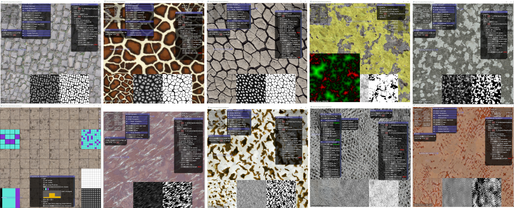

# Semi-Procedural Textures Using Point Process Texture Basis Functions

IMPORTANT : Please, wait that we finish our first tag/release version before downloading code and binaries (cleaning some files, images rights, etc...). This will be available at least for the EGSR 2020 conference 29 june - 3 july. We will create a dedicated release/tab v1.0.0 version.


This is the page of our EGSR 2020 CGF track paper:

P. [Guehl](https://pascalguehl.jimdofree.com/), R. [Allègre](https://igg.icube.unistra.fr/index.php/R%C3%A9mi_All%C3%A8gre), J.-M. [Dischler](https://dpt-info.di.unistra.fr/~dischler/), B. [Benes](http://hpcg.purdue.edu/bbenes/), E. [Galin](https://perso.liris.cnrs.fr/eric.galin/).
Semi-Procedural Textures Using Point Process Texture Basis Functions.
To appear in Computer Graphics Forum (EGSR 2020 special issue), 39(4),
2020.

## Paper

Available soon.

## Note

This work can be seen as a small step in the spirit of the "Inverse Shade Trees" approach, being able to retrieve the appearance from an image as a graph of nodes and edit it interactively. Node-based texturing tools such as Substance Designer could benefit from this kind of "art-directable" textures and materials to create complex appearances. This work also tries to mix Research, Industry and Art to enhance the creativity and the productivity of artists.

## Supplemental materials

### [1] Texture Synthesis Comparisons

 - [ ] **Supplemental #1** : Available soon. This supplemental material provides semi-procedural texture synthesis results using our method and comparisons to state-of-the-art texture synthesis methods.

 #### ex: Texture synthesis comparisons
 
 BDD of 138 textures (cells, cracks, dots, lines, scratches, waves, networks, tilings, etc...) processed by 11 different texture synthesis methods.
 
  
  
 ### [2] PPTBF Parameters Estimation, Noise Comparisons and Material Synthesis
 
 - [ ] **Supplemental #2** : Available soon. This supplemental material provides additional results on: PPTBF parameters estimation, comparisons to noise by example (structure only), material synthesis results, and synthesis results with structure transitions.
 
 #### ex: PPTBF Parameter estimation (i.e. by-example procedural structures)
 
 BDD of 147 segmented images, from automatic parameter estimations to refinement and fine-tuning :
 
 
 
 #### ex: Material synthesis
 
 BDD of 3D scanned materials and procedural PBR materials.
 
 
 
 ### [3] BDD of input exemplars
 
 - [ ] **Supplemental #3** : Available soon. This supplemental material contains the database of binary structures used for the paper in full quality. Note that for reasons of terms of use, we do not provide all corresponding texture exemplars. The folder Structures contains manually segmented binary structures. The
 folder Structures_with_PPTBF contains manually segmented binary structures with estimated PPTBF
 parameters, that can be used for procedural structure synthesis.
 
 #### ex: BDD of Textures
 
 

## Code

### Target Machines

Operating systems:
- [x] Windows 10
- [ ] Linux (Ubuntu soon available...)

Tested graphics cards:
- [x] NVidia GeForce 1060 GTX (6Go)
- [x] NVidia RTX 2070 (8 Go)

Technologies:
- OpenGL (4.6, at least >= 4.5, compute shaders), glad, glfw, glm, ImGui, CMake, C++, [Python to come]

### [1] PPTBF: procedural stochastic structures

 The [PPTBF_Structures_Src](PPTBF_Structures_Src) directory contains code required to produce
 procedural binary structures from files of PPTBF parameters, and a real-time viewer to be able
 to design and edit PPTBF parameters interactively (works under Windows, Linux port soon).
 More tools to come (ex: PPTBF database generator, spanning the space of PPTBF parameters).

 Check [this file](PPTBF_file_format.txt) to get a description of the PPTBF file format.

#### Tools
 
 Windows binaries are available [here](http://igg.unistra.fr/people/semiproctex/PPTBF_Structures_Bin.zip). We provide tools for experimenting with the PPTBF model:
 - [x] a real-time PPTBF viewer/designer [GPU-accelerated]
 - [x] a PPTBF synthesizer from a PPTBF parameter file [GPU-accelerated] (for procedural PPTBF and binary structures synthesis)
 - [ ] a PPTBF database generator [GPU-accelerated] (spanning space of parameters) [soon available...]

  #### ex: Real-time PPTBF viewer/designer
 
 
 
### [2] Semi-Procedural Texture Synthesis
 
 The [Semiproc_synthesis_Src](Semiproc_synthesis_Src) directory contains code required to synthesize
 textures from files of our semi-procedural texture synthesis parameters and PPTBF parameters (works under Windows, Linux port soon). Work in progress...

 Check [this file](semiProcTex_file_format.txt) to get a description of the semi-procedural texture file format. Work in progress...
 
#### Tools
 
 - [ ] The Semiproc_synthesis_Bin (file will be available soon. Cleaning some data and versioning...) archive
 contains Windows binaries for our semi-procedural texture synthesis method. The program is able
 to reproduce our texture synthesis results (i.e. color images) of Supplemental material #1.
 We provide the binaries of our GPU implementation. Note that a software version will be
 made available soon (for reasons of intellectual property, the GPU code cannot be
 distributed). How to: just drag'n'drop input exemplar images onto software 2D viewport to automaticcaly synthesize texture (files are provided with the binaries).
 
 - [ ] Here is a beta version of our semi-procedural texture software synthesizer Semiproctex_synthesis_CPU_Bin (file will be available soon. Cleaning some data and versioning...) (not GPU-accelerated). More info to come about available features and parameters description...
 
 NOTE: The software/CPU version uses the same algorithms than the GPU version. But the GPU one is more than 10 times faster (even far more depending on options). So the software/CPU version is only useful to look at the code, not launching synthesis. But you can try and test.
 
 #### ex: Real-time/interactive GPU semi-procedural texture synthesizer
 
 
  
 ## Data
 
 - [x] The PPTBF parameters estimated from our database of manually segmented structures are available
 following [this link](http://igg.unistra.fr/people/semiproctex/PPTBF_Parameters_v2.zip). Note
 that this is an updated version that improves the parameter values provided with the Supplemental
 materials.
 
 - [ ] You will soon find a link to our database of PPTBF parameters. Our database of PPTBF is distributed in 93 files/banks according to combinations of values of point process "tiling types", window function "profil types" and feature function "mixture model" types (stored as ".txt" files), approximately 100 Mo. Then, intermediate PPTBF files are generated by spanning the space of continous PPTBF parameters [approximately 130 Go for 1.2 million images of PPTBF in .png format of dimension 400x400 pixels each].
  
 - [ ] Our database of semi-procedural texture synthesis parameter files used for the supplementals will be available here soon...
 
<!--
### Prerequisites

### Getting started

 * Clone this repository.
 * ...
-->

## Citation

If you use this code for your research, please cite our paper.

```
@article{Guehl:EGSR2020,
    author = "P. Guehl and R. All\`egre and J.-M. Dischler and B. Benes and E. Galin",
    title = "Semi-Procedural Textures Using Point Process Texture Basis Functions",
    journal = "Computer Graphics Forum (EGSR 2020 special issue)",
    volume = "39",
    number = "4",
    year = "2020",
    note = "To appear"
}
```
