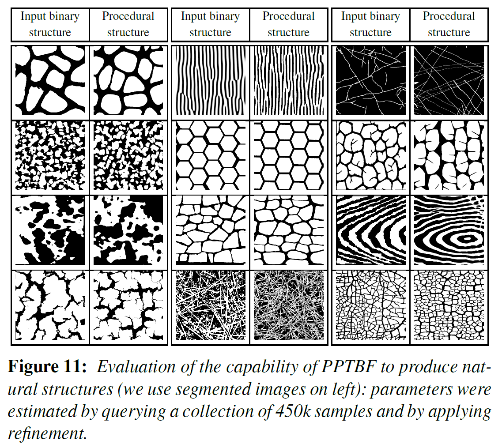
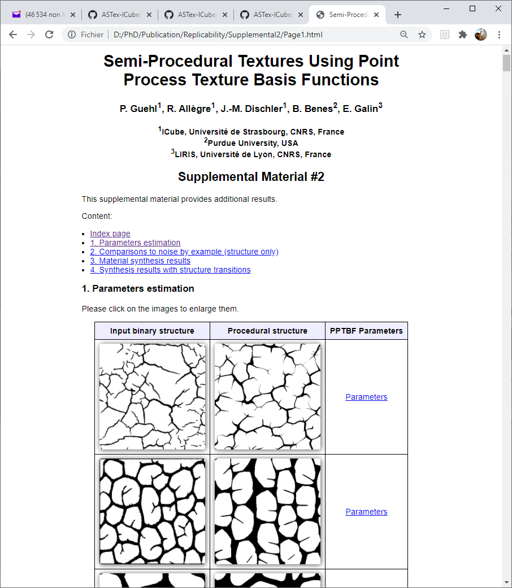

# Replicability

## Overview

This is a guide to reproduce the "visual structures" results from our procedural stochastic PPTBF model (i.e. binary images).

NOTE : It works on Windows systems for the moment. (Linux port soon)
We have tested the softwares with the following graphics cards:
- NVidia GeForce 1060 GTX (6Go)
- NVidia RTX 2070 (8 Go)

## How To

The code and binaries are able to at least reproduce the Figure 11 of our article, named "Evaluation of the capability of PPTBF to produce natural structures" (see below).

It is a short extract of our supplemental material #2 (available [here](http://igg.unistra.fr/People/semiproctex/data/Supplemental2_v100.zip)), especially page "Supplemental2/Page1.html" providing additional results on PPTBF parameters estimation (147 results). So, this supplemental material #2 is the reference data to compare (see below).

For this, we provide code required to produce procedural binary structures from files of PPTBF parameters. For instance, in the supplemental material #2, the directory : "Supplemental2\images\Matching_structures\cells\111357_seg_scrop" contains the original image "111357_seg_scrop.jpg", and we provide a parameter file "111357_seg_scrop_pptbf_params.txt" from which our PPTBF procedural model have generated images "111357_seg_scrop_pptbf.jpg" and its thresholded version "111357_seg_scrop_pptbf_binary.jpg" (that looks like the original image). The goal of our code and binaries is to replicate all files "xxx_pptbf.jpg" and "xxx_pptbf_binary.jpg" from parameter files "xxx_pptbf_params.txt" to looks like original images "xxx.jpg".

In the figure 11, you can find the following replicated images:

LEFT COLUMN (top to bottom):
- Data\Matching_structures\cells\20181215_153153_seg_scrop_pptbf_binary.png
- Data\Matching_structures\dots\bumpy_hard_concrete_texture_9261475_seg_scrop_pptbf_binary.png [NOTE: for this image, you may find a difference due to a translation in the original article]
- Data\Matching_structures\maps\foam_texture_seg_scrop_pptbf_binary
- Data\Matching_structures\cells\mud_flakes_closeup_150326_seg_scrop_pptbf_binary.png

MIDDLE COLUMN (top to bottom):
- Data\Matching_structures\lines\phasor_seg_scrop_pptbf_binary.png
- Data\Matching_structures\tilings\deephexa_seg_scrop_pptbf_binary.png
- Data\Matching_structures\cells\mosaicstones1_seg_scrop_pptbf_binary.png
- Data\Matching_structures\piles\straw_seg_scrop_pptbf_binary.png

RIGHT COLUMN (top to bottom):
- Data\Matching_structures\networks\Marble_seg_scrop_pptbf_binary.png
- Data\Matching_structures\cells\14596343807_24e447963c_o_seg_scrop_pptbf_binary.png
- Data\Matching_structures\grains\whiteash_seg_scrop_pptbf_binary.png
- Data\Matching_structures\cells\TexturesCom_Crackles0011_S_seg_scrop_pptbf_binary.png

We provide two ways to replicate data: either from a precompiled binary executable or from recompilation of source code from scratch (see below for details). 

### REPLICATE FROM BINARIES

Windows binaries are available in the archive [here](http://igg.unistra.fr/people/semiproctex/PPTBF_Structures_Bin.zip). We provide a unique script that replicates all binary images from supplemental #2 (see "Supplemental2/Page1.html" webpage), from which our figure 11 in our aticle is an extract.

#### Database info

The "Data" repository (in the binaries archive) contains all PPTBF files (Point Process Texture Basis Functions) of our database:
- there are currently 147 files storing PPTBF parameters describing the equivalent procedural models (in .txt format)
- here, they are classified by structures types (cells, lines, networks, dots, ...) BUT it's not mandatory
- they come from "manual segmentation" from a database of colored textures images (except for the "phasor", coming from the technical paper "Procedural Phasor Noise"),
  followed by the "parameter estimation" stage describes in our paper ([semi-]automatic followed by manual editing refinement)

#### Launching the PPTBF command line generator 

The command line PPTBF generator works either manually or in batch mode.

##### BATCH PROCESSING

Launch the unique script "launch_pptbf_results.bat" that will generate all images into the "Data\Matching_structures" directory.

NOTE:
- the script will launch the software "PtBDDGenerator.exe" in the "Bin" directory in batch mode,
   processing each of the 147 PPTBF files named "xxx_seg_scrop_pptbf_params.txt", where "xxx" is the PPTBF name
- all PPTBF files are in the "Data\Matching_structures" directory classified by types (cells, etc) in subdirectories
- generated images will be saved on disk near the PPTBF file "xxx_seg_scrop_pptbf_params.txt" file.

You can find all the detailed process in the PDF file: [Replicability_fromBinaries.pdf](Replicability_fromBinaries.pdf)

CUSTOMIZATION:
- User may change data path and data hierarchy structure in the script by modifying the variable "PPTBF_DATA_PATH"

##### MANUAL PROCESSING
The PtBDDGenerator.exe software works by providing a PPTBF file as parameter and PPTBF width and height, such as:
C:\PPTBF\Bin\PtBDDGenerator.exe C:\PPTBF\Data\Matching_structures\cells\111357_seg_scrop\111357_seg_scrop_pptbf_params.txt 400 400

BEWARE: you MUST prefix the exe and file by full path

### REPLICATE FROM SOURCE CODE

To replicate all from scratch, compile code in the [PPTBF_Structures_Src](../PPTBF_Structures_Src) directory following provided "readme.txt" in the same directory.

Then launch the unique script "replicate_pptbfResults_matchingStructures.bat" that will generate all images into the "Install\PPTBFProject\bin\Data\Matching_structures" directory.

NOTE: sometimes, the generation of 1 of the 147 images may seem to crash depending on systems (hardware?).
